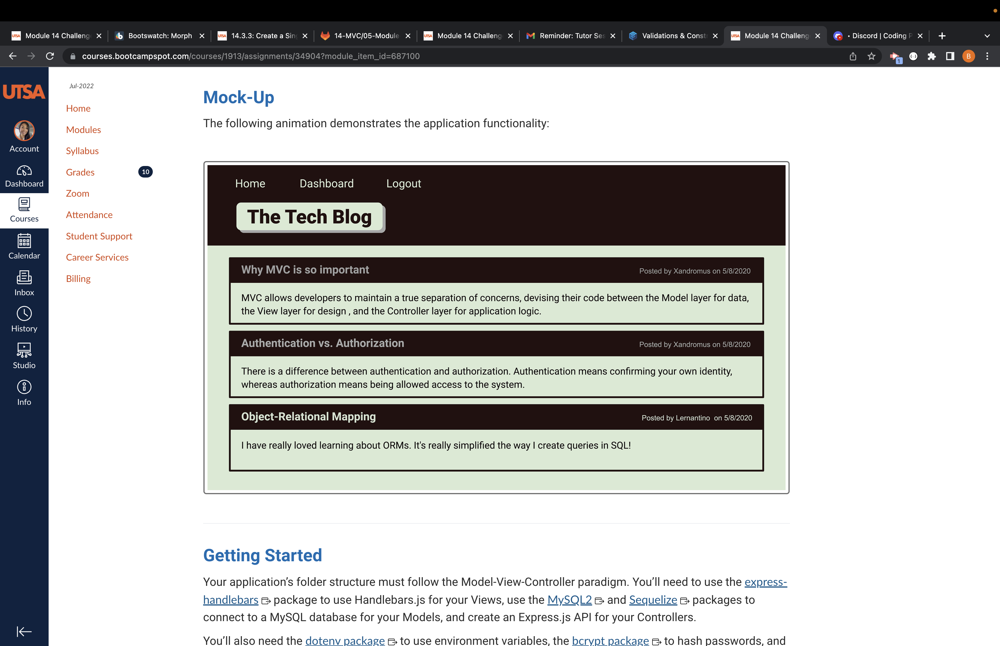

# blog

## title
 
Challenege-14 Model-view-controller-tech blog

* a CMS-style blog site that presents a homepage that includes an exisiting blog post, if any have been posted, navigation links, dashboard and the optin to login.
* ability to login and save password. save cookies with login.
* presented with the post title, contents, post creators username, and dat ecreated of the post. 
* when you click on create new blog or comment you have the ability to do so. ability to save and delte post. 

## url for github

https://github.com/brenbrenda55/blog

## screenshot of mock product (not mine finished work using example)

